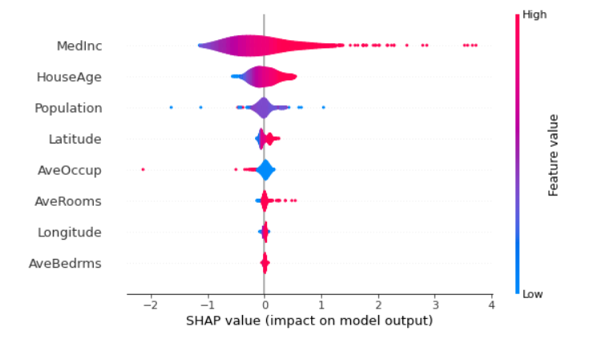

# shap_exercise

This is a Machine Learning project that utilizes the SHAP (SHapley Additive exPlanations) library for model interpretability and feature importance analysis.

I have used the California housing dataset inbuilt in scikit data library to predict the housing price given features like location(latitude,longitude), median income in a block, house age, average occupancy etc. As the model, a Multi Layer Perceptrons (MLP) regressor is chosen to train the data. This is followed up by shap value analysis. The shap library provides a handful of different visualization options (check the notebook for more examples), the summary plot is shown below. The features are ranked in terms of importance from top to bottom in the y axis. The x axis shows the shap values, and the absolute value scales with model importance. the plot also shows how a feature impacts the prediction in a positive or negative way. For example, the median income is the most important feature, and the higher values have a positive impact on the model. The shap analysis can be done instance by instance to know the effects of features on a particular prediction (see notebook).

Notes: Please note this project is to exercise and explore model explainability with shap values, the focus is not on optimizing ML model, as it appears there is still some overfitting in the model. In the next version, I plan to bulid the MLP with keras, instead of the scikit learn model that is used here, to have more control over model tuning. Additionally, calculating shap values on more samples would help get insight on roles of each feature.
